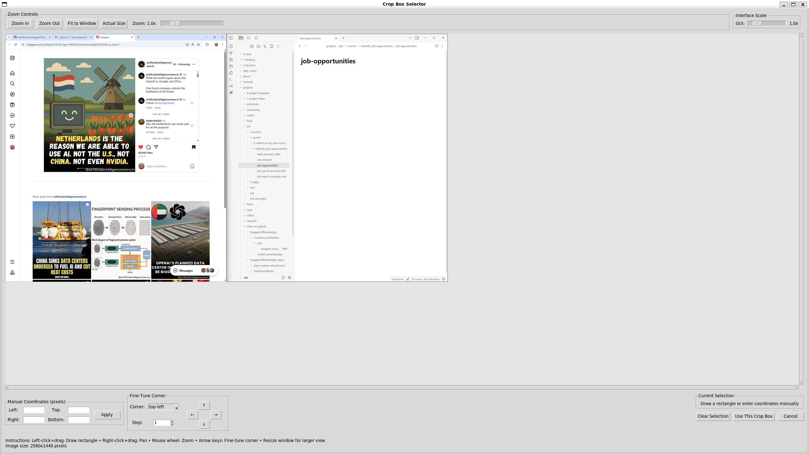
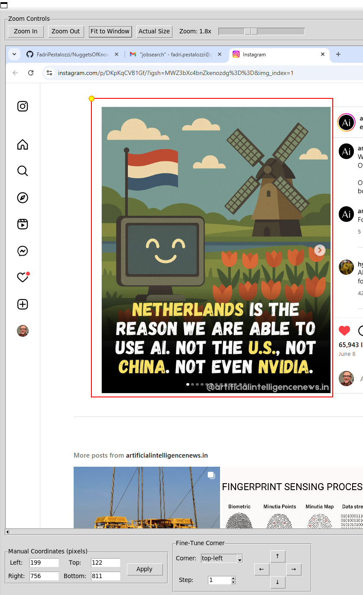
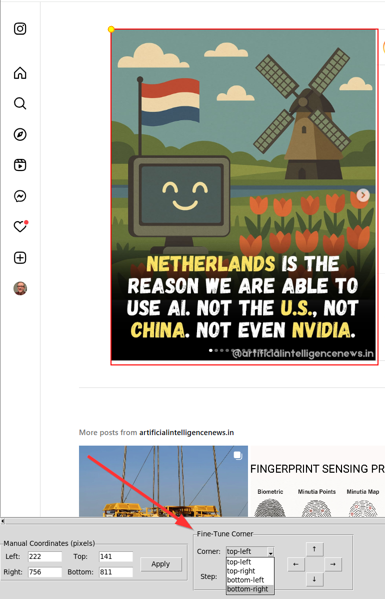
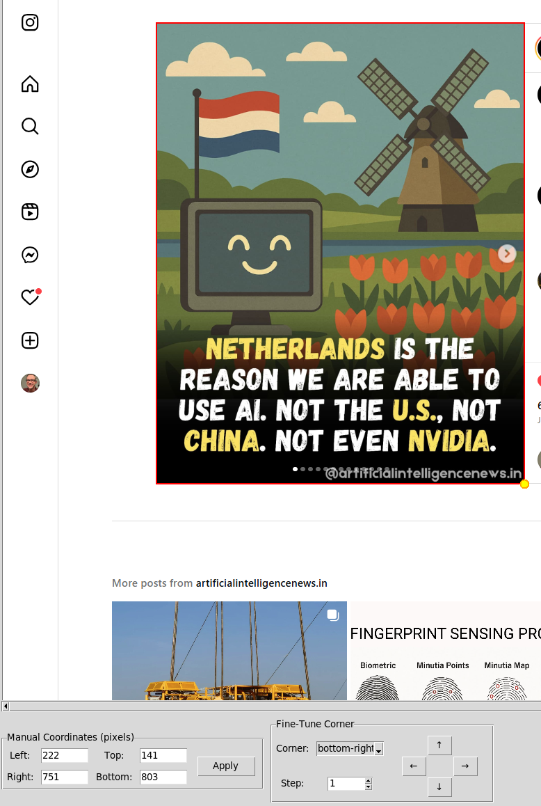
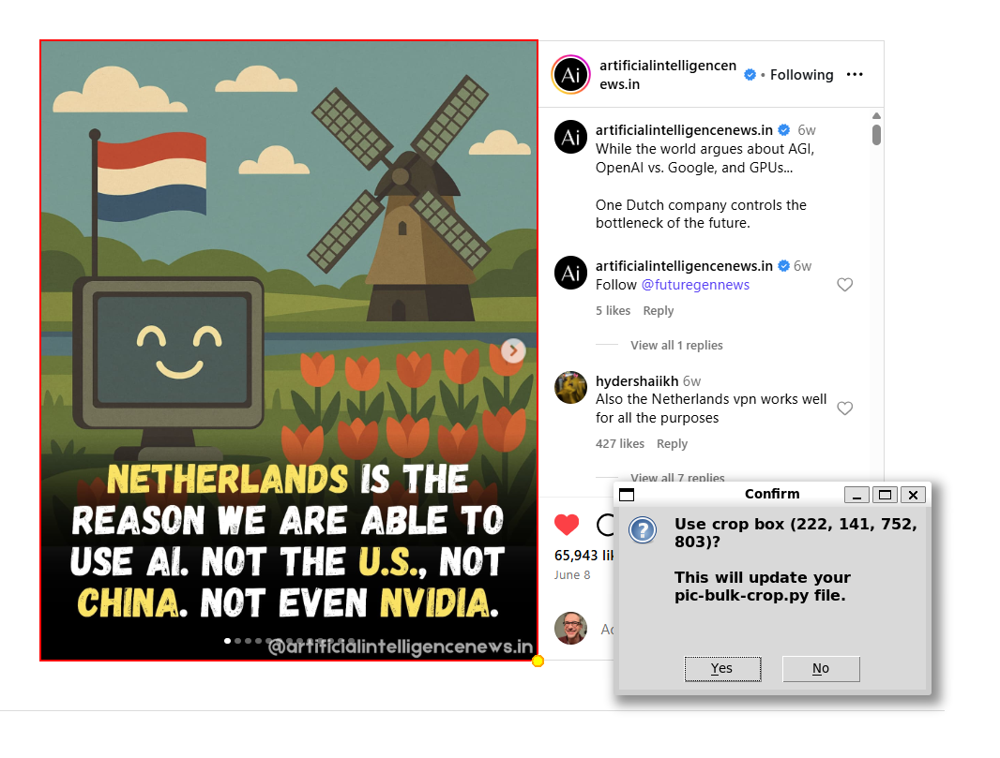

# BulkPicCropper

A Python-based tool for batch cropping images with a visual crop selection interface. Select the crop area once on a sample image, then apply the same crop to all images in a folder automatically.

## Features

- **Visual Crop Selection**: Interactive GUI to select crop area with mouse drawing
- **Batch Processing**: Apply the same crop to all images in a folder
- **Advanced Crop Selector**: 
  - Zoom in/out and pan functionality
  - Fine-tune crop corners with arrow keys or manual coordinate entry
  - Real-time preview of crop area and dimensions
  - Support for multiple image formats (PNG, JPG, JPEG, BMP, GIF)
- **User-Friendly Interface**: Simple folder selection dialogs
- **Preserved File Names**: Output files get "-cropped" suffix while preserving original names

## Requirements

- Python 3.x
- PIL (Pillow) for image processing
- tkinter (usually included with Python)

## Installation

1. Clone or download this repository
2. Install required dependencies:
```bash
pip install Pillow
```

## Usage

1. **Run the main script:**
```bash
python bulk-pic-cropper.py
```

2. **Select Input Folder**: Choose the folder containing images you want to crop

3. **Select Output Folder**: Choose where the cropped images will be saved

4. **Crop Selection**: The crop selector will open with the first image from your input folder

### Crop Selector Interface



The crop selector provides multiple ways to define your crop area:

- **Mouse Selection**: Left-click and drag to draw a rectangle
- **Manual Coordinates**: Enter exact pixel coordinates in the input fields
- **Zoom Controls**: Zoom in/out, fit to window, or view actual size
- **Pan**: Right-click and drag to pan around the image

### Fine-Tuning the Crop Area

Once you've made an initial selection, you can fine-tune it using:

- **Corner Selection**: Choose which corner to adjust (top-left, top-right, bottom-left, bottom-right)
- **Arrow Keys**: Use keyboard arrows to nudge the selected corner
- **Step Size**: Adjust how many pixels each arrow key press moves
- **Direction Buttons**: Click the arrow buttons in the interface







### Confirm Selected Cropping Coordinates

After adjusting the crop area, review the coordinates and confirm to apply your selected cropping area to all images in the input folder.




### Keyboard Shortcuts

- **Arrow Keys**: Move selected corner (when crop selector is active)
- **Right-click + Drag**: Pan around the image
- **Left-click + Drag**: Draw crop selection

5. **Confirm and Process**: Click "Use This Crop Box" to apply the crop to all images in the input folder

## How It Works

1. **Image Analysis**: The tool finds the first image in your input folder alphabetically
2. **Crop Definition**: You use the visual interface to define the crop area on this sample image
3. **Batch Processing**: The same crop coordinates are applied to all images in the folder
4. **Output Generation**: Cropped images are saved with "-cropped" suffix in your chosen output folder

## Example Output

If you have images like:
- `photo1.jpg`
- `photo2.png`
- `screenshot.jpg`

The output will be:
- `photo1-cropped.jpg`
- `photo2-cropped.png`
- `screenshot-cropped.jpg`

## File Structure

```
BulkPicCropper/
├── bulk-pic-cropper.py      # Main batch processing script
├── pic-crop-selector.py     # Crop selection GUI component
├── pic-input/               # Example input folder
├── pic-output/              # Example output folder
└── pics-4-readme/           # Documentation screenshots
```

## Technical Details

- **Image Processing**: Uses PIL (Pillow) for high-quality image manipulation
- **GUI Framework**: Built with tkinter for cross-platform compatibility
- **Coordinate System**: Uses (left, top, right, bottom) pixel coordinates
- **Image Formats**: Supports PNG, JPG, JPEG, BMP, and GIF formats

## Troubleshooting

- **No images found**: Ensure your input folder contains supported image formats
- **Crop selection not working**: Make sure to draw a valid rectangle (width and height > 0)
- **Images too large**: Use the zoom controls to navigate large images effectively
- **Memory issues**: For very large images or batches, process in smaller groups

## Tips

- **Preview First**: Always check the crop area on your sample image before processing the batch
- **Backup Originals**: Keep copies of your original images as this tool creates new files
- **Consistent Sizing**: This tool works best when all images in the batch have similar dimensions and content layout
- **Fine-Tuning**: Use the corner adjustment feature for pixel-perfect crops
